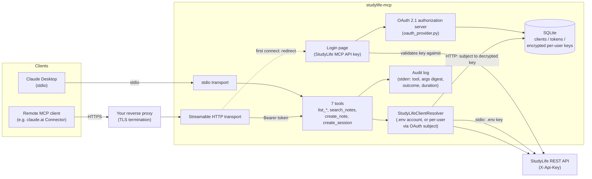

# studylife-mcp

[](https://github.com/lukislp/studylife-mcp/actions/workflows/ci.yml)
[](https://github.com/lukislp/studylife-mcp/releases)
[](LICENSE)
[](https://www.python.org/)

An [MCP](https://modelcontextprotocol.io) server exposing [StudyLife](https://github.com/lukislp/studylife)
(a self-hosted Blazor WASM + ASP.NET Core study-management platform, .NET 10)
to Claude and other MCP clients. It provides:

- **Read tools** — courses, notes (incl. full-text search), study sessions/calendar, and per-course learning goals.
- **Write tools** — create a note, create a study session. Nothing else: no update/delete tools exist, not even unimplemented.
- **Two transports** — stdio (Claude Desktop, single StudyLife account) and Streamable HTTP (remote, multi-user, behind your own reverse proxy).
- **A self-built OAuth 2.1 authorization server** for the HTTP transport — dynamic client registration, PKCE, and per-user login via StudyLife's own MCP API key, so multiple StudyLife users can share one deployment without ever seeing each other's data.
- **A structured audit log** (tool, argument digest, outcome, duration) for every tool call, on both transports.

This is a learning project and portfolio piece; design decisions and trade-offs
are logged in [docs/decisions.md](docs/decisions.md). Deliberately scoped
narrower than its sister project [studylife-ai](https://github.com/lukislp/studylife-ai):
no RAG, no agent loop — the MCP client (e.g. Claude) is the agent, this server
just exposes cleanly modeled tools.

## Status: S1–S4 done

**S1** (scaffold, `list_courses` over stdio, verified end-to-end in Claude
Desktop) and **S2** (the remaining read tools — notes, sessions, course goals —
with camelCase-alias DTOs mirroring StudyLife's real JSON shapes) are done.
**S3** is done: the two write tools, gated by the MCP client's own tool-approval
prompt (no server-side confirmation step — this project has no agent loop of
its own to pause), backed by a dedicated `McpApiKeyHash` StudyLife API-key slot
mirroring the existing Home-Assistant/studylife-ai pattern (implemented
directly in the `studylife` repo, not here — see [docs/decisions.md](docs/decisions.md)),
and a structured audit log on every tool call. **S4** is done: Streamable HTTP
transport, a self-built OAuth 2.1 authorization server with multi-user support
(see [Streamable HTTP + OAuth 2.1](#setup-streamable-http--oauth-21-remote-multi-user)
below), a non-root Docker image, and a verified [MCP Inspector](docs/mcp-inspector.md)
run. Every milestone was verified against the real StudyLife instance, not
just mocks — see [docs/decisions.md](docs/decisions.md) for each milestone's
full write-up, including two real bugs found live along the way (a silent
camelCase/snake_case field mismatch, and a double-`await` that crashed the
OAuth store's SQLite connection) and how they were caught.

Since S4, this server has also been deployed to the author's own production
K3s cluster via Flux CD GitOps (see [k8s/](k8s/)) and made publicly reachable
through Tailscale Funnel — deliberately scoped so this is the *only* service
in that cluster the tailnet ACL allows to become public (see
[docs/decisions.md](docs/decisions.md)). The previously-open RFC 7591 dynamic
client registration endpoint (`/register`, unauthenticated by protocol
design) is now rate-limited and self-cleans unused registrations — see
[Security notes](#security-notes).

Still open, deliberately deferred: submitting/listing this repo in public MCP
directories (see [docs/decisions.md](docs/decisions.md)).

## Architecture



stdio mode always uses the single `.env`-configured StudyLife account.
HTTP+OAuth mode resolves each authenticated caller to *their own* StudyLife
account: `authorize()` redirects the user's browser to this server's own login
page (not a generic username/password — the StudyLife MCP API key from
StudyLife's setup page), which validates the key live against StudyLife, then
binds every access/refresh token issued from that login to that account.
`StudyLifeClientResolver` looks up the right account per tool call from the
caller's access token — see [docs/decisions.md](docs/decisions.md) "Multi-user"
for the full reasoning, including why the login step is deliberately the one
piece that would change if login is ever federated to an external IdP
(Authentik/Keycloak) later.

## Setup: Claude Desktop (stdio, single StudyLife account)

1. Copy `.env.example` to `.env` and fill in your StudyLife instance URL and API key
   (Setup page in StudyLife → "StudyLife MCP Server" card → generate a dedicated key).
2. Install dependencies: `uv sync`
3. Add to your Claude Desktop config (`claude_desktop_config.json`):

   ```json
   {
     "mcpServers": {
       "studylife": {
         "command": "uv",
         "args": ["run", "--directory", "/absolute/path/to/studylife-mcp", "studylife-mcp"]
       }
     }
   }
   ```

   Where to find that file depends on how Claude Desktop was installed:
   - Classic installer: `%APPDATA%\Claude\claude_desktop_config.json` (Windows) /
     `~/Library/Application Support/Claude/claude_desktop_config.json` (macOS).
   - MSIX-packaged app (Microsoft Store-style install, package id starting `Claude_...`):
     `%APPDATA%` is redirected to
     `%LOCALAPPDATA%\Packages\Claude_<id>\LocalCache\Roaming\Claude\claude_desktop_config.json`.
     In-app: Settings → Developer → "Local MCP servers" opens this same file. Note the
     app's "Benutzerdefinierten Connector hinzufügen" dialog is for **remote** MCP servers
     (URL-based, Streamable HTTP) only — it does not accept a local command; local stdio
     servers are configured exclusively via this JSON file.

4. Restart Claude Desktop (fully quit, not just close the window). The
   `list_courses` tool should appear.

## Setup: Streamable HTTP + OAuth 2.1 (remote, multi-user)

Run this behind your own reverse proxy (TLS terminates there) to add
`studylife-mcp` as a **remote** MCP connector — e.g. via a client's "Custom
Connector" URL field. Unlike stdio mode, multiple StudyLife users can share one
running server: each person logs in with their own StudyLife MCP API key, and
every access token is bound to that one account.

1. In `.env`, in addition to `STUDYLIFE_BASE_URL`/`STUDYLIFE_API_KEY` (still
   needed as the stdio-mode/fallback account), set:

   ```bash
   MCP_PUBLIC_URL=https://studylife-mcp.example.com   # externally reachable, behind your reverse proxy
   MCP_TOKEN_ENCRYPTION_KEY=...                        # python -c "from cryptography.fernet import Fernet; print(Fernet.generate_key().decode())"
   ```

   `MCP_OAUTH_DB_PATH` (default `oauth.db`), `MCP_HTTP_HOST` (default
   `127.0.0.1`, `0.0.0.0` inside Docker), and `MCP_HTTP_PORT` (default `8000`)
   are optional.

2. Run it:

   ```bash
   uv run studylife-mcp-http
   # or, containerized (build locally):
   docker build -t studylife-mcp .
   docker run -p 8000:8000 --env-file .env -v studylife-mcp-data:/app/data studylife-mcp
   # or, the published image (CI builds and pushes ghcr.io/lukislp/studylife-mcp on every
   # release, multi-arch amd64/arm64 - see the "docker" job in .github/workflows/ci.yml):
   docker run -p 8000:8000 --env-file .env -v studylife-mcp-data:/app/data \
     ghcr.io/lukislp/studylife-mcp:latest
   ```

3. Add `https://studylife-mcp.example.com` as a remote MCP connector in your
   client. The client registers itself automatically (dynamic client
   registration, RFC 7591); on first connect you'll be sent to this server's
   own login page — enter your StudyLife MCP API key there once. Subsequent
   connections reuse the refresh token, no re-login needed.

Discovery endpoints (for debugging, or a client that doesn't auto-discover):
`GET /.well-known/oauth-authorization-server` and
`GET /.well-known/oauth-protected-resource`. The MCP endpoint itself is
`POST /mcp`, requiring `Authorization: Bearer <access_token>`.

### Production reference deployment

The author's own instance runs this way: Kubernetes (K3s) via Flux CD GitOps
(manifests in [k8s/](k8s/) — namespace/secret/network policies/ingress applied
once by hand, the rest continuously reconciled), with a private cert-manager
CA trusted via `STUDYLIFE_CA_CERT_PATH`, and made publicly reachable through
[Tailscale Funnel](k8s/07-tailscale-funnel.yaml) rather than a self-managed
reverse proxy. Public exposure is scoped to exactly this one service at the
tailnet ACL level (a dedicated Tailscale tag, not the operator's shared
default) — see [docs/decisions.md](docs/decisions.md) for the full rationale
and a real Tailscale-side incident hit along the way.

## Configuration

| Variable | Description |
|---|---|
| `STUDYLIFE_BASE_URL` | Base URL of your StudyLife instance, e.g. `https://studylife.example.com/` |
| `STUDYLIFE_API_KEY` | API key from StudyLife's setup page, sent as the `X-Api-Key` header. The stdio-mode account; also the HTTP-mode fallback for an unauthenticated request. |
| `MCP_PUBLIC_URL` | *(HTTP mode only)* Externally reachable base URL of this server, behind your reverse proxy. Used as both the OAuth `issuer_url` and `resource_server_url`. |
| `MCP_TOKEN_ENCRYPTION_KEY` | *(HTTP mode only)* Fernet key encrypting each user's StudyLife API key at rest in the OAuth store. |
| `MCP_OAUTH_DB_PATH` | *(HTTP mode only)* SQLite file for OAuth clients/tokens/per-user keys. Default `oauth.db`. |
| `MCP_HTTP_HOST` / `MCP_HTTP_PORT` | *(HTTP mode only)* Bind address. Defaults `127.0.0.1:8000` (`0.0.0.0` inside Docker). |

## Tools

| Tool | Effect |
|---|---|
| `list_courses` | Read-only. Lists all courses of the active study program (semester, code, color, icon, topics, ECTS). |
| `list_notes` | Read-only. Lists all notes (title, content, course/session link, timestamps). |
| `search_notes` | Read-only. Full-text searches notes by title and content. |
| `list_sessions` | Read-only. Lists all study sessions/calendar entries (course, time range, topic, notes, completion status). |
| `list_course_goals` | Read-only. Lists per-course learning goals (target date, completion status, grade, completed topics, tag). No aggregate ECTS total — see [docs/decisions.md](docs/decisions.md) for why. |
| `create_note` | Writes. Creates a new note (title, content, optional course/session link). |
| `create_session` | Writes. Creates a new study session/calendar entry for a course and time range; `is_completed` can log a session retroactively. |

All tools are available identically on both transports. In HTTP+OAuth mode,
each call runs against whichever StudyLife account the caller's access token
belongs to (see [Architecture](#architecture)). Every free-text field returned
(note title/content, session topic/notes, course-goal completion note) is
flagged in its tool's description as user-authored data, not instructions.

## Security notes

- **Whitelist by construction**: `create_note`/`create_session` are the only
  write-capable functions that exist at all — no generic "call this endpoint"
  tool, no update/delete tool, not even commented out.
- **Audit log**: every tool call (read and write, both transports) logs `tool`,
  a SHA-256 digest of its arguments (not the raw values — arguments can
  contain free text), `result` (`ok`/`error`), and `duration_ms` to **stderr**
  — never stdout, which carries the stdio JSON-RPC transport.
- **Per-user isolation in HTTP mode**: `StudyLifeClientResolver` fails closed
  (`PermissionError`) if a valid access token's subject has no stored StudyLife
  key — it never falls back to the `.env` account for an authenticated caller.
- **StudyLife keys are encrypted, not just hashed**, in the OAuth store — this
  server needs the plaintext back to call StudyLife on the user's behalf,
  unlike StudyLife's own key storage (hash-only, StudyLife itself never sees
  the plaintext again after generation).
- **Hardened dynamic client registration**: `POST /register` is unauthenticated
  by protocol design (RFC 7591 — any MCP client self-registers with no prior
  credentials), which is a free, repeatable target for bots once this server
  is publicly reachable. `RegistrationRateLimitMiddleware` caps it to 5
  registrations/hour per source IP; any client that registers but never
  completes the OAuth flow within 24h is purged on the next registration
  attempt, so the store stays bounded regardless of registration volume. See
  [docs/decisions.md](docs/decisions.md) for what this does and doesn't
  protect against.
- **Rate-limited tool calls**: `POST /mcp` is already authenticated (a valid
  Bearer token is required), so this isn't about anonymous abuse — it bounds
  a legitimate-but-buggy or compromised client (a runaway loop) rather than a
  scanner. Limited per-token (not per-IP, since identity already exists once
  authenticated) to 300 requests/hour, generous over realistic usage.
- **Connected-apps self-service, internal-only**: `/connected-apps` lets a
  StudyLife user see which OAuth clients hold a live refresh token for their
  account and revoke one — gated the same way `/login` is (a real StudyLife
  key, not the already-issued token). Deliberately unreachable from the
  public Tailscale Funnel URL: its `Ingress` uses an explicit path allowlist
  rather than a `defaultBackend`, so `/connected-apps` 404s at the ingress
  controller before ever reaching the pod, reachable only via the
  tailnet/LAN-only `studylife-mcp.heim.lan` route. See
  [docs/decisions.md](docs/decisions.md).

## Observability

`GET /metrics` (HTTP mode only) exposes Prometheus metrics: tool-call counts
and duration by tool and outcome (`studylife_mcp_tool_calls_total`,
`studylife_mcp_tool_call_duration_seconds`), rate-limit rejections by path
(`studylife_mcp_rate_limit_rejections_total`) — the same underlying
measurements as the structured audit log, just also exported for scraping —
and currently registered OAuth clients by activation status
(`studylife_mcp_registered_clients{status="activated"|"pending"}`, queried
fresh from the database on every scrape), a direct window into whether the
DCR rate-limit/TTL-cleanup pair is keeping up with real traffic, not just
that it exists.
Reached only by the author's own in-cluster Prometheus (pod-to-pod, not
through any Ingress/Gateway/Funnel path — see [k8s/](k8s/) and
[docs/decisions.md](docs/decisions.md)); running this yourself, point your
own Prometheus at the same port. No distributed tracing — deliberately
deferred, see [docs/decisions.md](docs/decisions.md).

## Development

```bash
uv sync
uv run ruff check .
uv run mypy src
uv run pytest
```

## Roadmap

- [x] **S1** — Scaffold, `list_courses` over stdio, verified end-to-end in Claude Desktop.
- [x] **S2** — Remaining StudyLife read tools (notes, sessions, course goals), camelCase-alias DTOs, contract tests.
- [x] **S3** — Write tools (`create_note`, `create_session`), dedicated `McpApiKeyHash` key slot, structured audit log.
- [x] **S4** — Streamable HTTP transport, self-built OAuth 2.1 authorization server (multi-user), non-root Docker image, verified [MCP Inspector](docs/mcp-inspector.md) run.
- [x] Production deployment to a real K3s cluster via Flux CD GitOps (see [k8s/](k8s/)), semantic-release + Docker-publish CI pipeline.
- [x] Public exposure via Tailscale Funnel, scoped to exactly this one service at the ACL level, plus rate-limiting/TTL-cleanup hardening for the previously-open dynamic client registration endpoint.
- [x] Connected-apps self-service page (internal-only), per-token rate limiting on `/mcp`, Prometheus metrics + Grafana dashboard on the author's own cluster.
- [ ] Distributed tracing — deliberately deferred (logs + metrics cover current needs), see [docs/decisions.md](docs/decisions.md).
- [ ] Submit/list this repo in public MCP directories — deliberately deferred, see [docs/decisions.md](docs/decisions.md).

## Tech stack

| Component | Technology |
|---|---|
| Server | Python 3.12, official MCP Python SDK (`mcp` ≥2.0) |
| HTTP client | `httpx`, verified against the OS certificate store (`truststore`) or a custom CA (`STUDYLIFE_CA_CERT_PATH`) |
| Config | `pydantic-settings` + `.env` |
| OAuth store | `aiosqlite`, StudyLife keys encrypted at rest with `cryptography.fernet` |
| Tests | `pytest` + `respx` (HTTP mocking) + an ASGI test client for the OAuth login route |
| Metrics | `prometheus-client`, scraped by the author's own self-hosted Prometheus |
| CI/CD | GitHub Actions (`ruff`, `mypy --strict`, `pytest`, semantic-release, multi-arch Docker publish to GHCR, Trivy scan) |
| Deployment | Docker (non-root) · Kubernetes (K3s) via Flux CD GitOps, see [k8s/](k8s/) · public exposure via Tailscale Funnel |

## License

[AGPL-3.0](LICENSE), matching the main [StudyLife](https://github.com/lukislp/studylife) repository.
